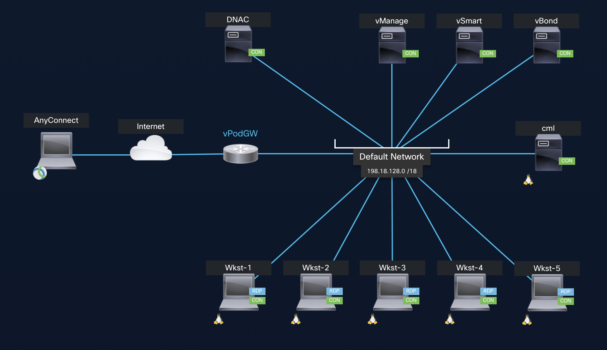

# Infrastructure as Code for Cisco Catalyst Center and Catalyst SD-WAN Manager with Terraform - LTROPS-2341

## General Information

Beneath you will find:

- [General information regarding the lab](#scenario)
- [Lab Overview](#lab-overview)
- [Network Diagram](#network-diagram)

### Scenario

In this lab activity, you will learn how to use Terraform to deploy and configure Cisco Enterprise Networking Solutions.

- In the first mission you will configure a new SD-WAN cEdge Router to establish Fabric-Connectivity at your branch.

- In the second mission you will deploy Branch-Switching by onboarding and configuring a Catalyst 9000 Switch.

- In the third mission you will add a new VPN to your SD-WAN cEdge Router and a new VLAN to your Catalyst 9000 Switch.

### Lab Overview

The lab is accessable via AnyConnect (Secure Connect Client). For each pod there is a workstation (Wkst-1 to Wkst-5) with the needed tools (like VS Code, Terraform, and Chrome) installed.

#### Network Diagram

Your personal site (pod) featuring a router and a switch and is running in Cisco Modeling Labs (CML). The controllers (vManage & Catalyst Center) are shared across five simulated sites.

#### Overlay IP Addressing

##### VPN20

| Site    | VRF | Subnet         |
| ------- | --- | -------------- |
| Site 11 | 20  | 172.20.11.0/24 |
| Site 12 | 20  | 172.20.12.0/24 |
| Site 13 | 20  | 172.20.13.0/24 |
| Site 14 | 20  | 172.20.14.0/24 |
| Site 15 | 20  | 172.20.15.0/24 |

##### VPN21

| Site    | VRF | Subnet         |
| ------- | --- | -------------- |
| Site 11 | 21  | 172.21.11.0/24 |
| Site 12 | 21  | 172.21.12.0/24 |
| Site 13 | 21  | 172.21.13.0/24 |
| Site 14 | 21  | 172.21.14.0/24 |
| Site 15 | 21  | 172.21.15.0/24 |

---

  <a href='../README.md'>Prev: Home</a> - <a href='../How to get started/README.md'>Next: How to get started</a>

---
