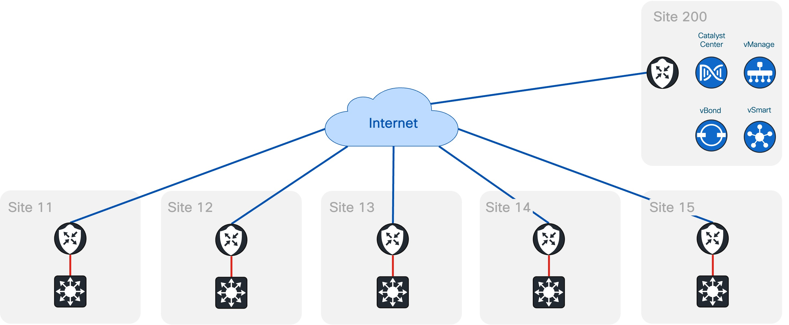

# Infrastructure as Code for Cisco Catalyst Center and Catalyst SD-WAN Manager with Terraform - LTROPS-2341

## General Information

Beneath you will find general information regarding the lab and basic explanation about terraform.

:warning:
:exclamation: To get started with your missions, open the Missions directory (in this repository) for your site and follow the corresponding readme.

### Network Diagram



### Overlay IP Addressing

| Site   | VRF | Subnet         |
| ------ | --- | -------------- |
| Site11 | 20  | 172.20.11/0/24 |
| Site12 | 20  | 172.20.12/0/24 |
| Site13 | 20  | 172.20.13/0/24 |
| Site14 | 20  | 172.20.14/0/24 |
| Site15 | 20  | 172.20.15/0/24 |

### Working directories

You should have at least three different working directories, one for each mission. In each directory you shall create a main.tf file where you will write your terraform code. If you’re familiar with Terraform you could also work with modules and use your own structure – else the easiest way is to use this simple approach:


### Basic Terraform commands

```bash
terraform init
```

The command "terraform init" is used to initialize a working directory that contains Terraform configuration files. It does the following:

- Plugin Initialization
- Provider Validation
- Backend Configuration
- Dependency Resolution
  By running "terraform init" before executing other Terraform commands, you ensure that your environment is properly set up, dependencies are resolved, and the necessary plugins are available. It's a crucial step to prepare your Terraform workspace for infrastructure provisioning and management.

```bash
terraform plan -out "planfile"
```

The "terraform plan -out" command in Terraform is used to generate an execution plan and save it to a specific file, referred to as the "planfile". Here's what it does:

- Execution Plan Generation
- Planfile Creation: By specifying the "-out" flag followed by a filename (e.g.,
  "planfile"), Terraform saves the generated execution plan to the specified file. The planfile contains detailed information about the resources to be created, modified, or destroyed, as well as any associated dependencies or relationships.
  Preventing Accidental Changes: Saving the execution plan to a planfile provides an additional layer of safety when applying changes. Before applying the plan, you can review the planfile to ensure that the proposed changes align with your intentions and do not have any unintended consequences. This helps prevent accidental or undesired modifications to your infrastructure.

```bash
terraform apply "planfile"
```

The terraform apply command is used to apply the changes described in a Terraform execution plan to the infrastructure. By specifying a "planfile" as an argument to the apply command, you can apply a specific execution plan instead of having Terraform generate a new plan.

- Apply the execution plan: To apply the changes described in the execution plan file, you use the terraform apply command with the "planfile" as an argument. For example, terraform apply myplan.tfplan applies the changes specified in "myplan.tfplan" to the infrastructure.
- Create or Modify Resources: Terraform compares the desired state defined in the configuration files with the current state of your infrastructure. It determines the changes required to align the infrastructure with the desired state and executes those changes. This can involve creating, modifying, or destroying resources, depending on the changes needed.
- State Update: Terraform updates the state file that tracks the current state of your infrastructure. The state file stores information about the resources Terraform manages, allowing it to track changes, perform updates, and maintain the desired state over time.

```bash
terraform destroy
```

The terraform destroy command is used to destroy the infrastructure that has been created and managed by Terraform. It effectively tears down all the resources and components provisioned by Terraform, bringing the infrastructure back to its original state or completely removing it.

- Reads the Terraform configuration
- Determines the set of resources to destroy
- Generates a destruction plan
- Destroys the resources
- Updates the Terraform state
  It's crucial to exercise caution when using terraform destroy as it permanently removes resources and can result in data loss. It's recommended to take backups and thoroughly review the destruction plan before executing the command.

### Resource and Data source

In Terraform, both resources and data sources are used to represent and interact with infrastructure components, but they serve different purposes and have distinct behaviors.

- Terraform Resource: A Terraform resource represents a provisioned infrastructure component, such as a virtual machine, a database, or a network resource. Resources are declared and managed within your Terraform configuration files using a resource block. When you apply your Terraform configuration, resources are created, updated, or destroyed to match the desired state defined in your configuration.
- Terraform Data Source: A Terraform data source allows you to fetch information or access existing resources that are managed outside of Terraform. Data sources provide a way to query and retrieve information from external systems, such as cloud providers or other APIs, and make that information available for use within your Terraform configuration.
  To summarize, resources represent the infrastructure components you manage and provision with Terraform, while data sources allow you to fetch information to use within your Terraform configuration. Resources are created, updated, or destroyed by Terraform, while data sources provide read-only access to external data.
